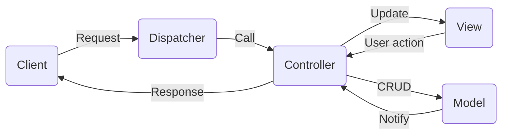

## 「Webプログラミング演習」サンプルプログラム（MVCモデル）

### 1. MVCモデルによるアプリケーションの構造

### 2. フォルダ・ファイルの説明
- `.gitignore`ファイル：`GitHub`によるバージョン管理をしたくないフォルダやファイルを指定する。
- `.htaccess`ファイル： Apache Webサーバーでディレクトリ単位の設定を格納するファイルである。実在しないフォルダやファイルへのアクセスをすべて`index.php`へ転送するように設定している。これにより、`/u/list/`のようなリクエストは、`index.php`で解析し、解析結果に応じて、適切なコントローラーを選び、アクションを引き起こすことができる。
-`index.php`ファイル：アプリケーションの入り口として、クライアント側のリクエストを適切に解析し、各機能のプログラムへ誘導していく。
- `app`フォルダ：アプリケーションのソースコードを格納するフォルダ。
  - `app/controllers`サブフォルダ：コントローラー関連のプログラム（クラス）を格納するフォルダ。
  - `app/models`サブフォルダ：モデル関連のプログラム（クラス）を格納するフォルダ。
  - `app/views`サブフォルダ：ビュー関連のプログラム（クラス）を格納するフォルダ。
  - `app/views/layout`サブフォルダ：各画面のレイアウトを記述するファイルを格納するフォルダ。
  - `app/Dispatcher.php`ファイル：リクエスト解析を行い、コントローラーを通して必要な機能を呼び出す。
- `conf`フォルダ：設定ファイルを格納するフォルダ。
  - `config.inc.php`：アプリケーション共通の設定ファイル。アプリケーション関連の`app`、MVCモデル関連の`mvc`等が含まれている。
  - `server-development.php`：開発用サーバの設定ファイル。データベース接続`db`等が含まれている。
  - `server-deployment.php`：本番用サーバの設定ファイル。データベース接続`db`等が含まれている。

### 3. その他のドキュメント
- [コーディング規約](./docs/コーディング規約.md)：コーディングルール（変数名や改行に関するルール）
- [MVCモデルの実装方法](./docs/MVCモデルの実装.md)：MVCモデルの実装方法（モデル、ビュー、コントローラー実装の詳細）
- [モーダルウィンドウ](./docs/モーダルウィンドウ.md)：モーダルウィンドウの実装方法（警告や確認のダイアログウィンドウ）
- [初期データベース](./docs/初期データベース.sql)：データベースのスキーマ定義と初期データ導入に必要なSQL文。

