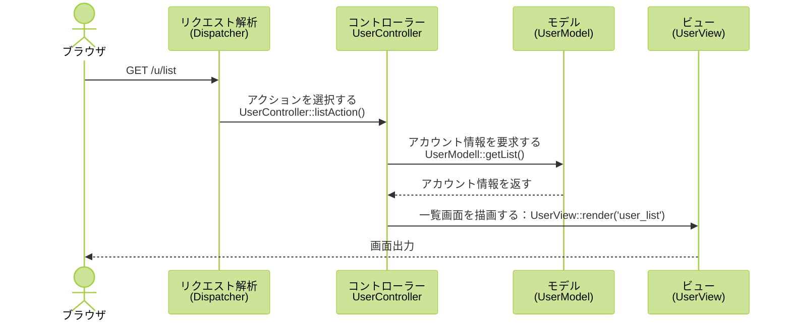
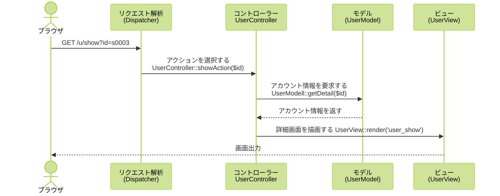
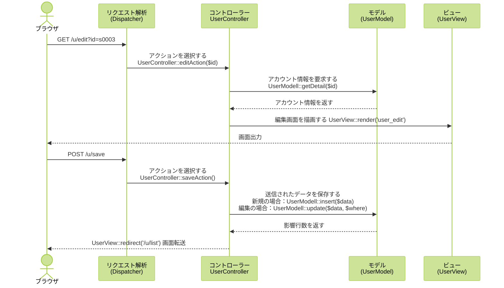
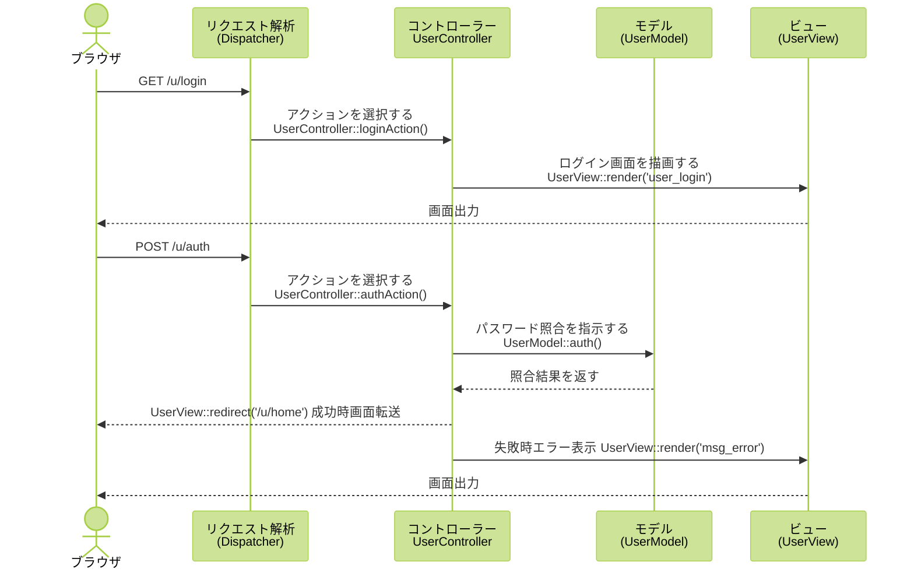
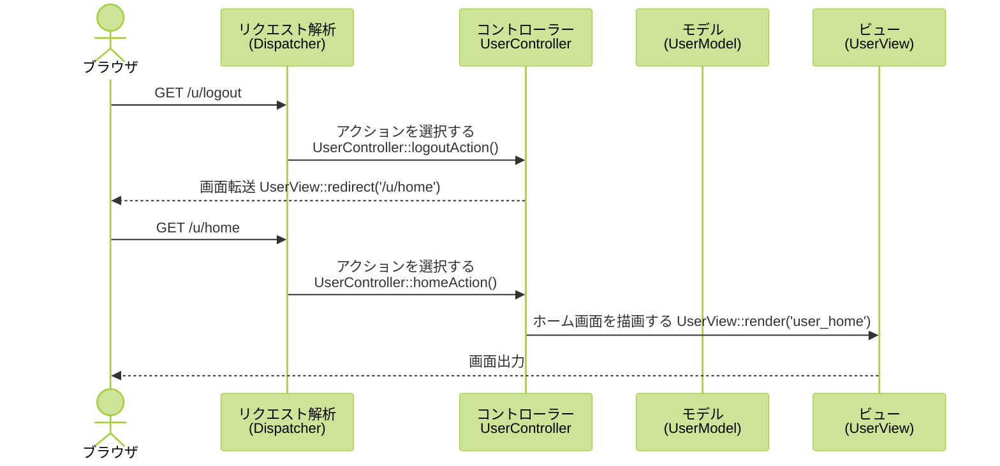
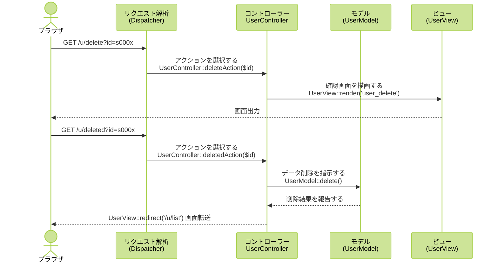

[TOC]

# MVCモデル実装の詳細

## 1. URLパターン

URL短縮やセキュリティ対策等の目的で、各機能へアクセスするためのURLは、実在するフォルダ・ファイル名を使わず、以下のパターンを採用する。

 `/<クラスID>/<アクション名>[/]?<key1>=<value1>&<key2>=<value2>`。最後の`/`は省略できる。例：
  - `/u/edit/?id=s0002`、`/u/edit?id=s0002` 、`<クラスID>`は`u`、`<アクション名>`は`edit`、アクションを呼び出すときの引数は`id=s0002`である。
  - 引数のないURL、例えば、`/u/list`, `/u/login`も可。　

## 2. リクエスト解析・アクションの呼び出し（dispatch）
1. `.htaccess`の設定により、リクエストを`index.php`へ転送する。
2. `index.php`で、リクエストパターンを解析し、以下の情報を抽出する
  - `<アプリケーションロート>`：(`htdocs`以下にある)アプリケーションのホームディレクトリ。例：`/wp2026mvc`
  - `<クラスID>`：例：`u`
  - `<アクション名>`：例：`list`
  - `<アクションの引数>`：例：`id=s0002`
3. 解析結果に基づき、必要なコントローラークラス、モデルクラス、ビュークラスのインスタンスを作成する
4. コントローラーに対して、引数を渡して特定のアクションを呼び出す。
5. アクションの中では、モデルに必要なデータを求め、結果をビューに渡して、画面を生成させる

## 3. モデルに関するフォルダ・ファイル：

- `app/models/Model.php`：**モデルの基礎となるクラス**。データベース接続、基本的なＣＲＵＤ処理等を実現している。

  - `__construct($conf)`：データベース接続情報を引数にモデルを初期化するコンストラクタ。
  - `query($sql)`：問い合わせのSQL文を実行し、結果を配列として返すメソッド。
  - `excute($sql, $where)`：更新のためのSQL文を実行し、影響を受けた行数を返すメソッド。
  - `getList($where, $orderby, $limt, $offset)`：あるテーブルに対する問い合わせ結果を返すメソッド。
  - `getDetail($where)`：あるテーブルから一行のみを返すメソッド。
  - `insert($data)`：あるテーブルに1行のテータを追加するメソッド。
  - `delete($where)`：あるテーブルから条件を満たすデータを削除するメソッド。
  - `update($data, $where)`：あるテーブルの条件を満たすデータを更新するメソッド。
  - `insertID()`：直近自動生成されたIDの値を返すメソッド。
  - `sanitize($string)`：文字列をサニタイズ（無害化）するメソッド。攻撃に使われそうな文字を無害化する。

- `app/models/UserModel.php`：**ユーザアカウントを管理するクラス**。`Model`クラスを継承しモデルの基本機能が使える。

  - `auth($uid, $passwd)`：パスワード照合を行うメソッド。

## 4. コントローラーに関するフォルダ・ファイル

- `app/controllers/Conroller.php`：**コントローラーの基礎となるクラス**。
  - `__construct($model, $view)`：モデルクラス`$model`とビュークラス`$view`を引数にコントローラーを初期化するコンストラクタ。
  - `errorAction($msg)`：すべてコントローラーで共通するアクションメソッド。エラーメッセージを出力する。
- `app/controllers/UserController.php`：ユーザアカウントに関する機能を利用可能にするクラス。
  - `homeAction()`：ホームページを表示するアクション。
  - `loginAction()`：ログイン画面を表示するアクション。
  - `authAction()`：パスワード照合を行うアクション。
  - `logoutAction()`：ログアウトを行うアクション。
  - `listAction()`：アカウントを一覧するアクション。
  - `showAction()`：アカウント詳細を表示するアクション。
  - `editAction()`：アカウントの編集画面を表示するアクション。
  - `saveAction()`：編集結果を保存するアクション。
  - `deleteAction()`：削除を確認するアクション。
  - `deletedAction()`：削除を確定するアクション。

## 5. ビューに関するフォルダ・ファイル

- `app/views/View.php`：
  - `__contruct($base)`：プロジェクト・ホームディレクトリ`$base`を引数にビューを初期化するコンストラクタ。
  - `render($layout, $data)`：画面レイアウトを元に、`$data`を使って画面を生成する。
  - `redirect($url)`：引数の**URL**へ画面を転送する。 URLは以下のパターンに従う。
    - 「`/クラスID/アクション/`」、「`/クラスID/アクション`」、「`/クラスID/アクション/?key=val`」、「`/クラスID/アクション?key=val`」
    - 例：`/u/list/`または、`/u/list`、`/u/edit/?id=s0001`または、`/u/edit?id=s0001`
  - `share($var, $value)`：画面レイアウトに共通の変数をシェアする。
- `app/views/UserView.php`
  - `View`クラスを継承している。
- `app/views/layout`フォルダ：
  - `bs5_page_header.php`：Bootstrap5対応のページヘッダー
  - `bs5_page_footer.php`：Bootstrap5対応のページフッター
  - `page_header.php`：ページのヘッダー
  - `page_footer.php`：ページのフッター
  - `msg_error.php`：エラーメッセージを表示する画面。
  - `msg_confirm.php`：確認を行う画面。承認されたら次のアクションを起こす。
  - `user_login.php`：ログイン画面。
  - `user_list.php`：アカウント一覧画面。
  - `user_show.php`：アカウント詳細画面（削除ボタン・編集ボタン）。
  - `user_edit.php`：アカウント編集画面。

## 6. アカウント管理の各機能の実装方法

### アカウント一覧

### アカウント詳細

### アカウント編集

### ログイン

### ログアウト

### アカウント削除

